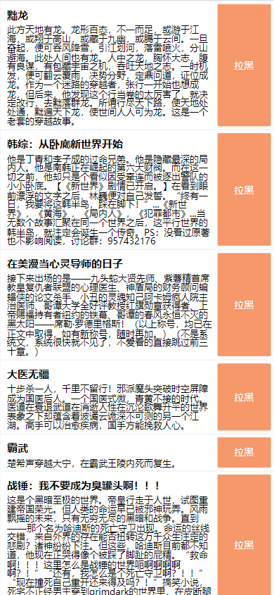

<h1 align="center">起点黑名单小说记录与过滤</h1>
<p align="center">
    <a href="https://github.com/cctyl/qidian-black-book-filter/issues" style="text-decoration:none">
        
    </a>
    <a href="https://github.com/cctyl/qidian-black-book-filter/stargazers" style="text-decoration:none" >
        
    </a>
    <a href="https://github.com/cctyl/qidian-black-book-filter/network" style="text-decoration:none" >
        
    </a>
</p>

# 前言
[项目地址](https://github.com/cctyl/qidian-black-book-filter) 
[演示视频](https://www.bilibili.com/video/BV1tu411L7qW)

曾经我也沉迷于小说，也曾**苦恼于找不到想看的小说**。
每次找小说如同**大海捞针**，**每次都在排行榜上重复查找，重复看见不喜欢的**
于是开发了这款软件。

这款软件的原理是，直接从起点中文网的月票排行榜抓取数据，提供给用户选择。
当你觉得这个小说不好看，不喜欢，直接拉黑，该小说就会在排行榜上隐藏。

这样我们就可以遍历整个排行榜，不断的把不喜欢的小说拉黑，大大提高了查找小说的效率，
对于不喜欢的一律隐藏，节省下我们重复点击的时间。

对于感兴趣的小说，直接点击就可以跳转到起点上进行试读，若试读发现不好看，直接返回拉黑即可。

支持对 小说的 标题、描述 进行关键词过滤。
比如那种一眼就看出来的小白文，或者不喜欢这类题材的小说，可以直接通过关键词过滤掉，不展示在界面上。

起点的排行榜上，约有1.5w 本小说，具体数字每个月都在变动。
相信有了这款软件，大伙在查找小说的过程中，可以更加便捷。


# 注意

这个软件设计之初，没有考虑多人使用，所以数据隔离，登录什么的，都没有做，
也就是说这个软件不支持多人使用，只支持自己使用。

当然，你完全可以把它改成多人使用，只需要做好黑名单书籍id 的数据隔离即可

对了，默认是男频的排行榜接口，女频没有做呢...

# 截图
- 主界面 

​    
# 食用

## 服务端环境要求

- nodejs16
- mongodb


## 步骤
1. git clone
2. 修改配置

- 数据库配置（默认端口，以及无账号密码情况下可以忽略）
	qidian-black-book-filter\model\db.js

	如果你的mongodb需要密码，则打开 8-16行注释，并修改第9行的账号密码

	```js
	/*
	mongoose.connect('mongodb://账号:密码@127.0.0.1:27017/gps?authSource=admin',function (err) {
	
		if (err)
			console.log(err)
		else
			console.log("数据库连接成功")
	});
	*/
	```

	如果你的mongodb不需要密码，并且端口也是默认的，那么无需修改

- 端口配置
	qidian-black-book-filter\qidian.js  318行
	
	```js
		app.listen(7094); //改成你想要的端口
	
	```
	
# 定制化配置

- 黑名单关键词
	在qidian-black-book-filter\qidian.js  136行
	
	```js
		//直接添加到这里即可
		let blackWord = [
			
		];
	```
